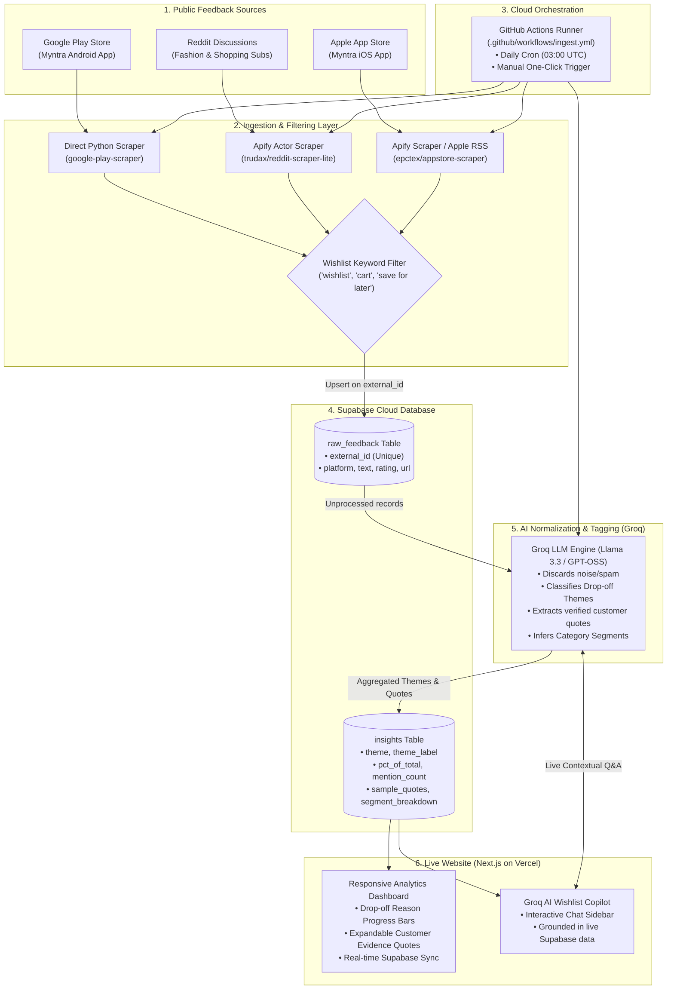

# System Architecture: Myntra Wishlist-to-Purchase Conversion Intelligence Engine

## Overview

The **Myntra Wishlist-to-Purchase Conversion Intelligence Engine** is a fully automated, end-to-end AI discovery system built entirely on **100% free-tier infrastructure**. It captures public customer feedback across multiple platforms (Google Play Store, Reddit, Apple App Store), filters for wishlist and purchase abandonment signals, normalizes themes using Groq's high-speed LLM inference, and presents real-time intelligence on a live Next.js dashboard with an interactive AI Copilot.

---

## Architecture Diagram

---

## 4-Layer Architecture Breakdown

### 1. Data Ingestion Layer (Three Sources, Two Methods)
- **Play Store (Direct Scraping):** Uses `google-play-scraper` in Python to fetch recent reviews directly without third-party services or login requirements.
- **Reddit (Apify Actor):** Triggers `trudax/reddit-scraper-lite` via the Apify API to search queries like `"myntra wishlist"`, `"myntra cart"`, and `"myntra save for later"`.
- **Apple App Store (Apify + Apple RSS Fallback):** Connects to the Apify App Store actor with a fallback to direct Apple customer reviews RSS endpoints.
- **Keyword Pre-filtering:** Every review is filtered for wishlist/purchase intent keywords (`wishlist`, `wish list`, `save for later`, `saved item`, `bookmark`, `cart`, `buy later`, `shortlist`) before insertion.
- **Deduplication:** All records use `on_conflict='external_id'` upserts to prevent duplicate rows across repeated runs.

---

### 2. Database Layer (Supabase PostgreSQL)
Separates raw data from cleaned data to ensure high data integrity:
- **`raw_feedback`:** Unfiltered repository of scraped reviews with `external_id`, `platform`, `text`, `url`, `author`, `rating`, and `scraped_at`.
- **`insights`:** Cleaned and aggregated table used directly by the frontend, containing `theme`, `theme_label`, `mention_count`, `pct_of_total`, `sample_quotes` (text array), `segment_breakdown` (JSONB), and `trend`.

---

### 3. AI Normalization & Tagging Layer (Groq Llama 3.3)
- **Script:** [`scripts/normalize_ai.py`](file:///d:/NEXTLEAP/Myntra%202/scripts/normalize_ai.py)
- **Model:** Groq's high-speed Llama 3.3 / GPT-OSS inference with structured JSON formatting.
- **Functions:**
  1. Filters noise and non-shopping spam.
  2. Classifies feedback into core drop-off themes (e.g. *Price & Discount Delay*, *Pincode Undeliverability*, *Checkout/Payment Friction*, *Quality/Fabric Doubts*).
  3. Extracts the clearest supporting customer quote.
  4. Calculates percentage share and category distribution (Footwear, Apparel, etc.).
- **Rate-Limiting & Cost:** Includes exponential backoff and retry handling, operating safely at **$0 ongoing cost** on Groq's free tier.

---

### 4. Orchestration & Automation Layer (GitHub Actions)
- **Workflow:** [`.github/workflows/ingest.yml`](file:///d:/NEXTLEAP/Myntra%202/.github/workflows/ingest.yml)
- **Triggers:**
  - Automated daily cron schedule at `03:00 UTC` (8:30 AM IST).
  - Manual one-click trigger via `workflow_dispatch`.
- **Secrets Management:** Credentials (`SUPABASE_URL`, `SUPABASE_ANON_KEY`, `APIFY_API_TOKEN`, `GROQ_API_KEY`) are passed securely via GitHub Repository Secrets.

---

### 5. Serving & Presentation Layer (Next.js on Vercel)
- **Framework:** Next.js with App Router and Vanilla CSS design system.
- **Design Aesthetic:** Obsidian dark mode (`#070a12`) with signature Myntra magenta-pink (`#ff3f6c`) and cyber cyan gradients, glassmorphism cards, and responsive layout.
- **Dashboard Features:**
  - Real-time KPI summaries (Total Feedback, Top Wishlist Drop-off Driver, Friction Bottleneck).
  - Visual theme distribution progress bars.
  - Expandable verified customer evidence quotes with platform badges.
- **Wishlist AI Copilot:**
  - Embedded conversational assistant in the right sidebar.
  - Serverless API route (`/api/chat`) that feeds live Supabase context to Groq for grounded Q&A.
- **Auto-Sync:** Auto-refreshes data on each daily pipeline run without needing any redeployment.

---

## Free-Tier Infrastructure Summary

| Component | Platform | Free-Tier Allowance | Cost |
|---|---|---|---|
| **Database** | Supabase | 500MB PostgreSQL, unlimited API requests | **$0** |
| **Scraping** | Direct + Apify Free | $5 monthly free credits on Apify | **$0** |
| **AI Inference** | Groq Cloud | Generous RPM & 100k+ daily tokens | **$0** |
| **Automation** | GitHub Actions | 2,000 free runner minutes / month | **$0** |
| **Web Hosting** | Vercel | Unlimited serverless deployments & traffic | **$0** |
| **Total Pipeline Cost** | | | **$0.00 / month** |
